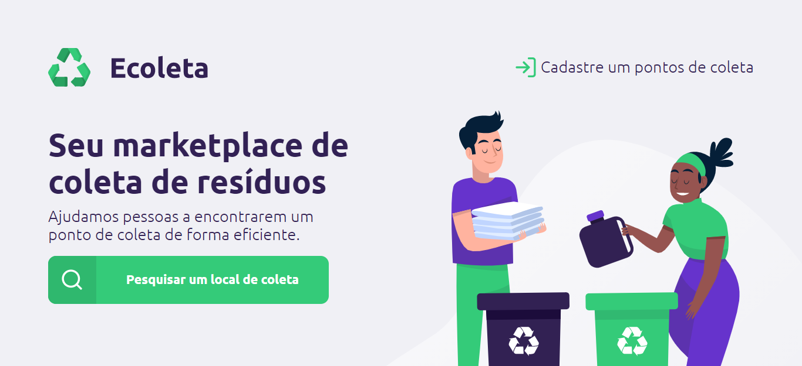

<h3 align="center">
    
    ♻️Ecoleta is a project developed at event Next Level Week # 1 of Rocketseat.
</h3>

## 🚀Objectives
Make people find a waste collection point closer, in addition to allowing companies and / or entities to register their collection point, facilitating the correct disposal of recyclable materials.

## 🛠️Tecnologies
### Server
<ul>
    <li><a href="https://nodejs.org/pt-br/">Node</a></li>
    <li><a href="https://expressjs.com/pt-br/">Express</a></li>
    <li><a href="https://mozilla.github.io/nunjucks/">Nunjunks</a></li>
    <li><a href="https://www.sqlite.org/index.html">SQLite3</a></li>
</ul>

###  Utilities
<ul>
    <li>IDE: <a href="https://code.visualstudio.com/">Visual Studio Code</a></li>
    <li>API: <a href="https://viacep.com.br/">ViaCEP REST API</a>, <a href="https://servicodados.ibge.gov.br/api/docs/localidades?versao=1#api-UFs-estadosUFGet">IBGE REST API</a></li>
    <li>API Test: <a href="https://insomnia.rest/">Insomnia</a></li>
    <li>Design pattern: <a href="https://www.devmedia.com.br/introducao-ao-padrao-mvc/29308">MVC</a></li>
    <li>Prototype: <a href="https://www.figma.com/file/fJBkiq6pITrL4infz9hwX7/Ecoleta?node-id=0%3A1">Figma</a></li>
    <li>Fonts: <a href="https://fonts.google.com/specimen/Roboto">Roboto</a>, <a href="https://fonts.google.com/specimen/Ubuntu?query=ubuntu">Ubuntu</a></li>
</ul>

## 💡Implementations

✅Search state and city by CEP

## 🕹️How run
Install dependencies: 
<code>
    yarn install
</code>  
Run server: 
<code>
    yarn start
</code>  
Open your browser in this address: 
<code>
    http://localhost:3000/
</code>
